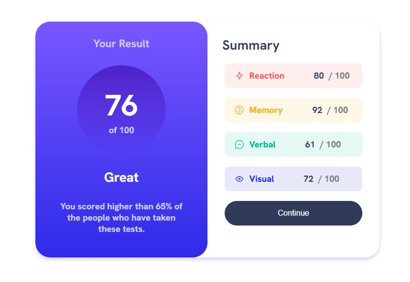

# Frontend Mentor - Results summary component solution

This is a solution to the [Results summary component challenge on Frontend Mentor](https://www.frontendmentor.io/challenges/results-summary-component-CE_K6s0maV). Frontend Mentor challenges help you improve your coding skills by building realistic projects.

## Table of contents

- [Overview](#overview)
  - [The challenge](#the-challenge)
  - [Screenshot](#screenshot)
  - [Links](#links)
- [My process](#my-process)
  - [Built with](#built-with)
  - [What I learned](#what-i-learned)
- [Author](#author)

## Overview

### The challenge

Users should be able to:

- View the optimal layout for the interface depending on their device's screen size
- See hover and focus states for all interactive elements on the page
- **Bonus**: Use the local JSON data to dynamically populate the content

### Screenshot

### Links

- Solution URL: [Add solution URL here](https://your-solution-url.com)
- Live Site URL: [Add live site URL here](https://your-live-site-url.com)

## My process

### Built with

- Semantic HTML5 markup
- CSS custom properties
- Flexbox

### What I learned

During this project, I learned to effectively use Flexbox and the `position` property in CSS. Here are the key skills I acquired:

- **Flexbox**:

  - **Creating Flexible Layouts**: I mastered the use of `display: flex` to build flexible and responsive layouts, allowing for smooth adjustment of elements within the container.
  - **Alignment and Distribution**: I learned to use properties such as `justify-content` and `align-items` to precisely control the alignment and distribution of elements.
  - **Managing Direction and Wrapping**: I understood how to use `flex-direction` to create layouts that automatically adapt to the available space.

- **Position Properties**:
  - **Relative Positioning**: I mastered the use of `position: relative` to move elements relative to their normal position, enabling precise adjustment of their placement within the Flexbox container.
  - **Absolute Positioning**: I learned to apply `position: absolute` to precisely position elements within their container, providing greater control over their placement.

These skills allowed me to create more advanced and flexible layouts in my project, improving its responsiveness and usability.

## Author

- Website - [Sebastian](--)
- Frontend Mentor - [@yourusername](https://www.frontendmentor.io/profile/yourusername)
